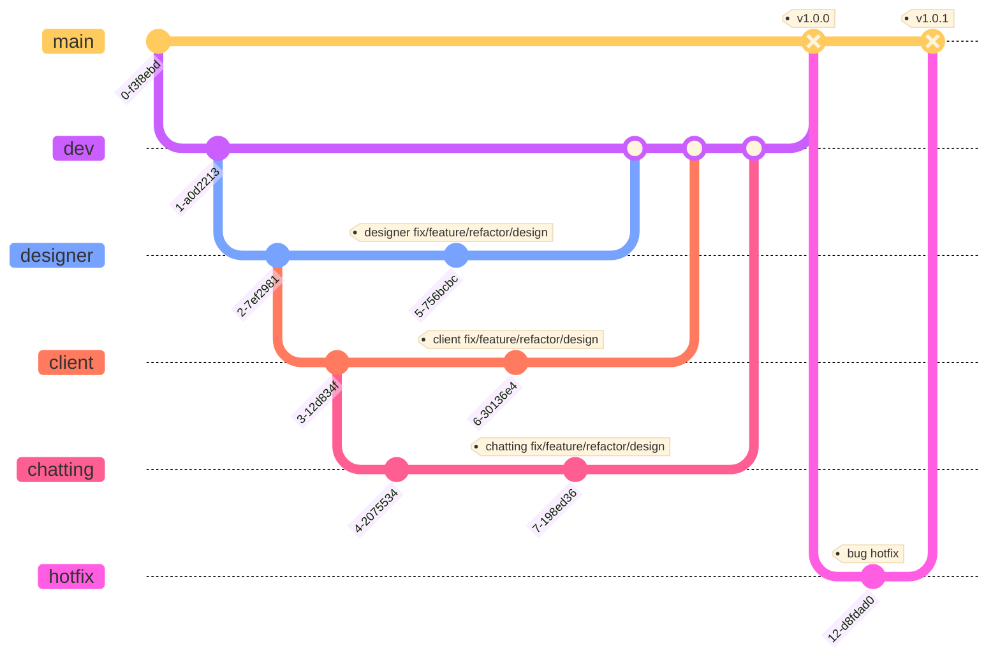

# YeDi


# 프로젝트 소개
Yedi는 헤어 디자이너와 소비자를 연결해 소통을 원활하게 해주고 홍보, 예약, 결제 시스템을 갖춘 앱입니다.

### 개발 환경 및 기술
```
- iOS: Swift 5, xcode 15.0
- 디자인 툴: Figma
- 협업 툴: Github, Notion, Discord
- 라이브러리: SwiftLint, Firebase, UserDefaults
- Deployment Target: iOS 16.4
- 다크모드 지원, 가로모드 미지원
```

### 기능 모아보기
#### 1) 고객
- `홈`: 추천 디자이너 게시물과 내가 팔로잉한 디자이너의 게시물을 모아볼 수 있습니다.
- `검색`: 디자이너를 검색하여 해당 디자이너의 프로필을 볼 수 있습니다.
- `예약내역`: 예약한 내역과 지난 예약을 모아볼 수 있습니다.
- `채팅`: 디자이너와 채팅 상담을 통해 소통할 수 있습니다.
- `프로필`: 내 정보와 찜한 게시물, 팔로잉한 디자이너, 내가 남긴 리뷰를 볼 수 있습니다.

#### 2) 디자이너
- `내 리뷰`: 다자이너에게 시술을 완료한 고객이 남긴 리뷰를 모아볼 수 있습니다.
- `내 게시물`: 헤어 스타일에 관련된 게시물을 업로드/수정/삭제할 수 있습니다.
- `예약현황`: 고객이 예약한 현황과 휴무일/휴게시간을 설정할 수 있습니다.
- `채팅`: 상담을 원하는 고객과 채팅을 통해 소통을 할 수 있습니다.
- `프로필`: 내 정보와 샵 정보를 수정하과 확인할 수 있습니다.

# Architecture

# 파일 디렉토리 구조
```
YeDi
 ┣ Client
 ┃ ┣ Model
 ┃ ┃ ┣ Client.swift                 // 고객 모델
 ┃ ┃ ┣ Keyword.swift                 // 키워드 리뷰 모델
 ┃ ┃ ┣ Reservation.swift             // 예약 정보 모델
 ┃ ┃ ┗ Review.swift                  // 리뷰 정보 모델
 ┃ ┣ View
 ┃ ┃ ┣ CMChatting
 ┃ ┃ ┃ ┗ CMMainChattingView.swift    // 고객용 채팅 메인 뷰
 ┃ ┃ ┣ CMHome
 ┃ ┃ ┃ ┣ CMHomeView.swift            // 고객용 홈 뷰 (게시물, 디자이너 등 표시)
 ┃ ┃ ┣ CMReservation
 ┃ ┃ ┃ ┣ CMReservationView.swift     // 고객용 예약 뷰
 ┃ ┃ ┣ CMReview
 ┃ ┃ ┃ ┣ CMNewReviewView.swift       // 새 리뷰 작성 뷰
 ┃ ┣ ViewModel
 ┃ ┃ ┣ CMHomeCellViewModel.swift     // 홈 셀에 대한 뷰 모델
 ┃ ┃ ┣ CMReservationViewModel.swift  // 예약 관련 뷰 모델
 ┃ ┃ ┗ CMReviewViewModel.swift       // 리뷰 관련 뷰 모델
 ┃
 ┣ Designer
 ┃ ┣ Model
 ┃ ┃ ┗ DmDesignerModels.swift        // 디자이너 모델
 ┃ ┣ View
 ┃ ┃ ┣ DMChattingView
 ┃ ┃ ┃ ┗ DMMainChattingView.swift    // 디자이너용 채팅 메인 뷰
 ┃ ┃ ┣ DMPostView
 ┃ ┃ ┃ ┣ DMNewPostView.swift         // 새 게시물 작성 뷰
 ┃ ┃ ┣ DMReservationView
 ┃ ┃ ┃ ┣ ReservationView.swift       // 디자이너용 예약 뷰
 ┃ ┃ ┣ DMReview
 ┃ ┃ ┃ ┣ DMReviewView.swift          // 디자이너용 리뷰 뷰
 ┃ ┣ ViewModel
 ┃ ┃ ┣ DMPostViewModel.swift         // 게시물 관련 뷰 모델
 ┃ ┃ ┣ DMReservationVM.swift         // 예약 관련 뷰 모델
 ┃ ┃ ┗ DMReviewViewModel.swift       // 리뷰 관련 뷰 모델
 ┃
 ┣ Shared
 ┃ ┣ View
 ┃ ┃ ┣ Auth
 ┃ ┃ ┃ ┣ LoginView.swift             // 로그인 뷰
 ┃ ┃ ┣ Chatting
 ┃ ┃ ┃ ┣ ChatRoomView.swift          // 공용 채팅방 뷰
 ┃ ┣ ViewModel
 ┃ ┃ ┣ AuthViewModel.swift           // 인증 관련 뷰 모델
 ┃ ┃ ┣ ChattingViewModel.swift       // 채팅 관련 공용 뷰 모델
 ┃
 ┗ YeDiApp.swift                     // 앱의 시작점
```

# 깃 브랜치 전략


# 주요 화면 및 기능 상세
## 로그인/회원가입
|`고객 회원가입`|`디자이너 회원가입`|
|:----:|:----:|
|  |  |

## 고객
### 홈
|`게시물`|`게시물 상세`|
|:----:|:----:|
|  | |

### 검색
|`디자이너 검색`|`디자이너 정보 보기`|
|:----:|:----:|
|  | |

### 예약
|`바로 예약`|
|:----:|
|  |

### 예약 내역
|`다가오는 예약`|`지난 예약`|
|:----:|:----:|
|  |  |

### 프로필
|`프로필 편집`|`찜한 게시물`|`팔로잉`|`리뷰`|
|:----:|:----:|:----:|:----:|
|  |  |  |  |

### 리뷰
|`리뷰 작성`|`리뷰 확인`|
|:----:|:----:|
|  |  |

### 설명 및 구현 기능
#### 홈 설명
- 추천 게시물과 팔로잉한 디자이너의 게시물 중 본인이 보고 싶은 카테고리를 선택한 뒤 아래로 스크롤 하여 다양한 게시물을 접할 수 있음
- 또한 마음에 드는 게시물을 찜하거나, 해당 게시물의 디자이너와 상담을 진행할 수 있음
- 게시물의 상단(디자이너 이미지, 이름, 샵 정보) 클릭 시 디자이너의 프로필로 연결되어 해당 디자이너가 올린 총 게시물과 그동안 받은 리뷰들을 한 눈에 볼 수 있으며 해당 디자이너를 팔로우할 수 있음
- 게시물의 이미지 클릭 시 게시물 상세로 연결되어 게시물의 전체 이미지와, 구체적인 내용을 볼 수 있으며 해당 디자이너와 관련하여 팔로우, 상담, 예약 등이 가능함

#### 홈 구현 기능
- 게시물 ) 게시물 페이지네이션
- 게시물 ) 게시물 하단의 하트 클릭 또는 게시물 이미지 더블 클릭시 찜하기 기능
- 게시물 ) 게시물 하단의 상담하기 버튼 클릭시 채팅으로 연결
- 게시물 상세 ) 게시물 이미지 오른쪽 상단의 하트 클릭시 찜하기 기능
- 게시물 상세 ) 해당 디자이너 팔로우 기능
- 게시물 상세 ) 하단의 상담하기 버튼 클릭시 채팅으로 연결
- 게시물 상세 ) 하단의 예약하기 버튼 클릭시 예약으로 연결

#### 홈 TroubleShooting 1
1. 문제상황 : 앱 실행 시 게시글 피드가 바로 불러와지지 않고 다른 뷰로 이동했다가 돌아와야 뜨는 문제
2. 원인 : 게시글을 불러오는 관련 뷰모델을 @ObservedObject로 선언했기 때문에
3. 해결 : 게시글을 불러오는 관련 뷰모델을 @StateObject로 선언하는 것으로 변경
4. 확인 : 앱 실행 시 게시글 피드가 바로 불러와짐
5. 얻은 점 : @ObservedObject의 경우 모델이 뷰의 라이프사이클에 의존하고 있지만 @StateObject의 경우 모델을 참조하기 때문에 뷰의 라이프사이클에 의존하지 않고, 뷰가 사라져도 프로퍼티가 살아있다는 점을 알 수 있었음

#### 홈 TroubleShooting 2
1. 문제상황 : 팔로잉한 디자이너 리스트에서 팔로잉 버튼 클릭 시 클릭한 디자이너 이외의 다른 디자이너의 팔로우 버튼의 상태도 같이 변하는 문제
2. 원인 : 객체를 공유하고 있어 하나의 버튼 상태를 바꾸면 다른 버튼의 상태도 바뀜
3. 해결 : 객체를 공유하지 않도록 분리하는 방향으로 수정
4. 확인 : 팔로잉 버튼이 상태가 공유되지 않고 독립적으로 동작
5. 얻은 점 : 객체를 통해 뷰를 구성할 때 독립적으로 동작해야되는 상황을 고려하고 이외에도 예외적인 상황에 대해서 대처를 잘해야겠다고 깨달음


#### 검색 설명
- 디자이너의 이름을 검색하여 고객이 선호하거나 궁금한 디자이너를 찾을 수 있음
- 디자이너를 누르면 해당 디자이너의 프로필로 이동하여 해당 디자이너의 정보를 구체적으로 알 수 있음
- 검색한 내용과 방문한 디자이너가 최근 검색에 저장되어 다음 검색 시에 편리함

#### 검색 구현 기능
- 최근 검색에 검색어와 방문한 디자이너가 모두 하나의 리스트에 저장되어 보기에 편리함
    - 텍스트를 입력 후 키보드 return을 하면 최근 검색에 저장
    - 이후에 특정 디자이너의 프로필을 다녀왔다면 해당 디자이너의 정보도 최근 검색에 저장
- 디자이너 프로필 ) 해당 디자이너 팔로우 가능 → 실시간으로 팔로워 수 반영
- 디자이너 프로필 ) 게시물 클릭시 게시물 상세로 연결되며, 리뷰 클릭시 리뷰 상세로 연결됨
- 디자이너 프로필 ) 리뷰에서 키워드 리뷰만 따로 볼 수 있도록 구현


#### 예약 설명
- 원하는 디자이너의 프로필이나 게시물에서 예약하기 버튼 클릭시 예약하기 뷰로 이동되어 예약을 진행할 수 있음
- 원하는 날짜와 시간, 그리고 진행하고 싶은 스타일을 선택하여 예약가능
- 해당 디자이너의 휴무일, 휴게시간, 그리고 다른 사람이 예약한 시간은 선택할 수 없음
- 예약이 완료되면 이후 예약 내역의 다가오는 예약에서 자신이 선택한 정보와 예약까지의 남은 날짜를 알 수 있으며, 실제로 스타일링을 받고 난 뒤에도 지난 예약에서 과거에 자신이 어떤 예약을 했었는지 파악하고 리뷰를 남길 수 있음

#### 예약 구현 기능
- 이번 달 이후에 해당하는 날짜를 선택할 수 있으며 디자이너가 설정한 휴무일을 반영하여 해당 날짜는 선택할 수 없도록 함.
- 디자이너가 설정한 오픈, 마감 시간 사이의 브레이크타임, 예약된 시간을 제외하고 선택이 가능
- 다양한 카테고리에서 원하는 스타일들을 여러가지 선택할 수 있으며 선택한 스타일의 총 금액 확인 가능
    - 예상 금액 변화 애니메이션 기능
- 예약 내역에서 날짜에 따라 다가오는 예약과 지난 예약으로 구분함
    - 다가오는 예약의 경우 예약일까지 며칠 남았는지 표시됨
    - 지난 예약의 경우 리뷰를 작성할 수 있음


#### 리뷰 설명
- 지난 예약에서 리뷰 작성하기 버튼 클릭 시 리뷰를 작성할 수 있는 뷰로 이동함
- 앱에서 제공하는 키워드 중 최대 5개를 클릭하여 간단하게 본인의 리뷰를 나타낼 수 있음
- 별점, 텍스트, 사진 등으로 해당 디자이너와 스타일에 대해 자세히 리뷰를 나타낼 수 있음
- 또한 이후의 본인의 프로필이나 해당 디자이너의 프로필에서 본인이 작성한 리뷰를 볼 수 있음

#### 리뷰 구현 기능
- 카테고리별로 키워드를 제공하고 선택할 수 있게 하여 리뷰를 작성하고 보는 데에 있어 편리함
- 사진 업로드 가능

## 디자이너
|`리뷰 확인`|
|:----:|
|  |

|`게시물 생성`|`게시물 편집`|`게시물 삭제`|
|:----:|:----:|:----:|
|  |  |  |

|`예약 현황 확인`|`휴무일 설정`|`휴게시간 설정`|
|:----:|:----:|:----:|
|  |  |  |

#### 구현 기능
1) 고객이 작성한 리뷰 모아보기
- 디자이너에게 예약과 시술을 마친 고객이 남긴 리뷰를 한 번에 확인할 수 있습니다.

2) 게시물 생성, 편집 및 삭제
- 디자이너만의 헤어 스타일에 대한 사진과 게시물 제목, 내용, 가격을 자유롭게 입력할 수 있습니다. `PhotoPicker`를 이용하여 로컬 사진를 불러올 수 있고 해당 화면에서 불러온 사진을 바로 확인 및 사진 삭제, 추가 작업을 이어서 진행할 수 있습니다.
- `actionSheet`를 통해 게시물을 편집할 수 있는 화면으로 이동합니다. 해당 게시물에 대한 데이터 불러오고 생성 작업과 동일하게 사진 수정 및 텍스트 수정이 가능하도록 구현하였습니다.
- `actionSheet`를 통해 해당 게시물을 삭제할 수 있습니다.

3) 캘린더 뷰어로 예약 현황 모아보기
- `Calendar`에 관련된 컴포넌트들을 이용하여 캘린더를 커스텀으로 구현하였고, 일별 타임라인을 구현하여 고객이 예약한 현황을 타임라인으로 스크롤하여 확인할 수 있습니다.

4) 휴무일 & 휴게시간 설정:
- 예약현황 탭에서 휴무일, 휴게시간 설정을 위한 플로팅 버튼을 구현하였습니다.
- 휴무일 설정 버튼을 클릭하면 이번 달 휴무일을 설정할 수 있는 sheet가 뜹니다. `Calendar`에 관련된 컴포넌트들을 이용하여 캘린더를 커스텀으로 구현하였고, 일별 버튼으로 구현하여 원하는 휴무일을 선택 및 해제할 수 있습니다. 휴무일을 설정하면 고객이 해당 디자이너에게 예약할 때 디자이너가 설정한 휴무일에는 예약을 하지 못하도록 구현하였습니다.
- 고정된 근무시간 중 휴게시간을 선택 설정할 수 있습니다. `Picker`를 이용하여 원하는 휴게 시간대를 선택할 수 있도록 구현하였습니다.

## 채팅
|`채팅방 리스트`|`게시물 상담 채팅`|`채팅방 내 사진 전송`|`채팅방 내 바로예약`|
|:----:|:----:|:----:|:----:|
| |  |  |  |

#### 구현 기능

1) 채팅방 리스트, 탭바 아이콘에 읽지 않은 메세지 개수 표출

2) 외부에서 채팅방 생성

- 게시물 상담하기 버튼 클릭 시 해당 게시물의 정보와 함께 채팅방이 생성이 되어 게시물을 올린 디자이너와 채팅을 할 수 있습니다.
- 디자이너 프로필에서 상담하기 버튼 클릭 시 빈 채팅방이 생성이 되어 자유롭게 채팅을 할 수 있습니다. 이미 채팅 내역이 존재한다면 해당 채팅방으로 연결이 됩니다.

3) UpScroll Pagination

- 채팅은 게시물 리스트와 달리 최근 메시지 버블이 하단에 존재해야 합니다. ScrollView와 메시지 버블에 `rotationEffect`와 `scaleEffect` Modifier를 사용하여 기존 스크롤을 뒤집은 효과를 주었습니다.
- 메시지 버블 데이터는 FireStore Database Query를 이용하여 보낸 메시지의 시간을 기준으로 마지막 데이터부터 순차적으로 불러오도록 구현하였고, 상단에 “지난 메시지 보기” 버튼을 두어 pagination을 완성시켰습니다.

4) 메시지 읽음 처리

- 메시지를 입력하면 FireStore Database에 누가 보냈는지에 대한 필드 데이터와 함께 `isRead`라는 필드 데이터도 저장을 시킵니다. 채팅방을 들어갔을 때 누가 보냈는지에 대한 필드 데이터와 현재 로그인한 유저의 id를 비교하여 isRead의 값을 변경시켜 메시지 읽음 처리를 구현하였습니다.

#### 고민한 점

1) 버블 메시지를 저장시킬 데이터베이스 채택 Realtime Database vs. Cloud Firestore

- 초기에 Realtime Database를 이용하여 채팅기능을 구현했지만 여러가지 문제가 발생했습니다.
    - 채팅에 새로운 버블이 생길 때 마다 모든 채팅을 다시 불러오는 방식을 사용해서 채팅 버블 개수가 증가함에 따라 네트워크 사용량 증가
    - 페이지네이션, 추가된 버블만 감지해서 추가 등을 시도해봤으나 실패
    - 메세지 업데이트 기능 구현(읽음 처리, 수정 등)에 한계를 느낌
- Realtime과 FireStore 중 고민하게 되었고 다음과 같은 결과를 얻을 수 있었습니다.
- Realtime Database와 Cloud FireStore 특징과 장단점 비교 그래프 
    
    
    | DB | Realtime Database | Cloud FireStore |
    | --- | --- | --- |
    | 특징 | - NoSQL Database <br> - 데이터를 하나의 큰 JSON 트리로 저장함    | - NoSQL Database <br> - 데이터를 문서 컬렉션으로 저장함  |
    | 장점 | - 단순한 데이터를 쉽게 저장함 <br> - 지연 시간이 매우 짧아 상태 동기화가 자주 발생할 때 적합함 | - JSON과 비슷하게 단순한 데이터를 문서에 쉽게 저장함 <br> - 문서에 있는 하위 컬렉션을 사용하여 복잡한 계층적 데이터를 대규모로 쉽게 정리할 수 있음 <br> - 실시간 데이터베이스보다 풍부하고 빠른 복합 정렬 및 필터링 기능을 갖춤 <br> - 큰 데이터 세트와 일괄 작업이 필요한 경우에 적합함 |
    | 단점 | - 복잡한 계층적 데이터를 대규모로 정리하기가 보다 어려움 <br> - 정렬 및 필터링 기능이 제한적임 <br> - 데이터 세트가 커짐에 따라 특정 쿼리의 성능이 저하됨 |  |


- Realtime Database와 Cloud FireStore를 각각 사용하여 조건 분석한 결과

    | 조건 | Realtime Database | Cloud Firestore |
    | --- | --- | --- |
    | 조건에 맞는 데이터를 잘 받아오는가? | 프로퍼티로 필터링 잘 안됨 | 매우 정확 |
    | 새 채팅 반응 체감속도 | 빠름 | 빠름 |
    | 간단한 네트워크 사용량 비교 실험 결과 (동일조건) | 전송 : 800 KB/s | 전송 : 80KB/s (페이지네이션 구현 시 더 줄일 수 있음) |
    | 페이지네이션 구현 여부 | 어려움 | 가능 |
    | 읽음처리(업데이트) | 어려움 | 가능 |

#### Trouble Shooting

1) 페이지네이션과 읽음처리 기능 병합

- 페이지네이션 기능 구현 이후 읽음 처리 기능을 추가하고자 했을 때, 채팅의 업데이트를 감지하는 새로운 기술이 요구되었습니다. 기존의 방식은 ‘변화’만을 감지하여 ‘추가’와 ‘업데이트’를 구분하지 못하여 프로퍼티 `isRead`  가 `false` 에서 `true` 로 값이 바뀌고 이를 서버에 날리면 서로 다른 버블이 생긴것으로 판단하여 채팅 버블이 두개가 되는 버그가 발생했습니다.
- `querySnapshot.documentChanges.forEach { diff in` 를 이용하여 `diff.type`의 값이 `.added`인 경우 메시지를 추가해주고 `.modified`인 경우 해당 메시지 내용을 업데이트 해주어 읽음처리 기능도 추가할 수 있었습니다.
- 그런데 앱이 채팅 내역을 처음 불러오는 경우 모든 채팅 버블이 .added 타입을 가져서 한 번에 모든 채팅들을 불러오게 되어 페이지네이션의 기능과 목적 둘 다 모두 잃게 되는 상황이 벌어졌습니다.
- `.limit(toLast: limitLength)` 를 이용해 처음 채팅을 불러올 때 길이의 제한을 두어 페이지네이션이 가능하도록 구현했습니다.

## 싱글톤 데이트 포맷
#### 구현기능

- 파이어 베이스 날짜 형식과 앱에서 처리하는 날짜 형식 통일 및 성능 향상을 위해 Singleton으로 관리 할 수 있는 DateFomatter 개발

#### 고민한점

1) 데이터 포맷 형식

- 초기엔 파이어베이스에 저장되는 날짜 형식이 통일되지 않아 개발하는데 어려움이 있었습니다. 이를 해결하고자 데이트 포맷 형식을 강제화하는 기능이 필요하다 생각해 싱글톤으로 데이트 포맷을 설정하였고 포맷은 국제적으로 사용하는 ISO8601(yyyy-MM-dd'T'HH:mm:ssZ)을 사용하는 것으로 DateFomatter를 개발하였습니다.
- 하지만 예외상황이 존재. 데이트 포맷에 자유를 줄 것인가?
    - 싱글톤으로 만든 Datefomatter로만 활용해 날짜 변환하는 메소드들을 개발했지만 저희 앱에선 예약하고 예약을 관리하는 복잔한 플로우가 존재했습니다. 싱글톤으로 개발한 DateFomatter 클래스 메소드만 활용해 처리하기엔 한계가 있었습니다. 따라서 한국 표준시간대로만 설정된 DateFomatter에 접근할 수 있는 메소드를 추가해 별도로 메소드 없이 각 ViewModel이 처리 할 수 있는 DateFomatter를 활용하게 예외를 두었습니다.

## 이미지 캐싱
#### 구현기능

- SwiftUI AsnycImage 사용시 메모리캐싱 우선 조회 및 캐싱처리

#### 고민한점

1) totalCostLimit vs. CountLimit

- evicated 되는 정책을 설정할 때 캐싱되는 수를 제한것과 용량 제한정책을 설정을 할 것인지 고민했습니다. 저희 앱에서 이미지 캐싱 목적은 네트워크 통신 최소화와 빠른 이미지 로딩 목적으로 이미지 캐싱 로직을 도입 했고 처음 용량을 제한 하는 것으로 정책을 설정했지만 이미지마다 데이터 크기 편차가 많아 잦은 evicated가 발생해 overhead로 이어졌습니다. 따라서 캐싱되는 이미지 갯수를 제한하는 것으로 결정했습니다.

2) 싱글톤 디자인패턴 채택

- 이미지 캐싱 뿐만 아니라 다른 텍스트(예로 채팅방 텍스트) 캐싱 가능성도 염두해 확장성을 고려해야 했습니다. 결과로 어느 곳에서 가져다 캐싱 할 수 있는 싱글톤 인스턴스로 캐싱 부분을 개발하였습니다.

# 팀원 소개
<table>
  <tbody>
    <tr>
      <td align="center"><a href="https://github.com/Rudy-009"><br /><sub><b>PM 이승준</b></sub></a><br /></td>
      <td align="center"><a href="https://github.com/SonYoonho"><br /><sub><b>PO 손윤호</b></sub></a><br /></td>
      <td align="center"><a href="https://github.com/choala"><br /><sub><b>팀원 박채영</b></sub></a><br /></td>
      <td align="center"><a href="https://github.com/Jaehui-Yu"><br /><sub><b>팀원 유재희</b></sub></a><br /></td>
     <tr/>
      <td align="center"><a href="https://github.com/ParkChanH"><br /><sub><b>팀장 박찬호</b></sub></a><br /></td>
      <td align="center"><a href="https://github.com/APP-iOS2/final-yedi/edit/dev/README.md"><br /><sub><b>팀원 송성욱</b></sub></a><br /></td>
      <td align="center"><a href="https://github.com/yunjikimm"><br /><sub><b>팀장 김윤지</b></sub></a><br /></td>
      <td align="center"><a href="https://github.com/ksj0109188"><br /><sub><b>팀원 김성준</b></sub></a><br /></td>
    </tr>
  </tbody>
</table>
