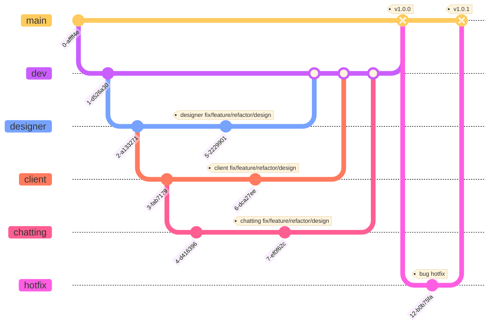

# YeDi


# 프로젝트 소개
Yedi는 헤어 디자이너와 소비자를 연결해 소통을 원활하게 해주고 홍보, 예약, 결제 시스템을 갖춘 앱입니다.

# 기술 스택
- 개발 환경
  - iOS: Swift 5, xcode 15.0
  - 디자인 툴: Figma
  - 협업 툴: Github, Notion, Discord
- 데이터베이스
  - Firebase, UserDefaults
- Deployment Target
  - iOS 16.4

# Architecture

# 파일 디렉토리 구조
```
YeDi
 ┣ Client
 ┃ ┣ Model
 ┃ ┃ ┣ Client.swift                 // 고객 모델
 ┃ ┃ ┣ Keyword.swift                 // 키워드 리뷰 모델
 ┃ ┃ ┣ Reservation.swift             // 예약 정보 모델
 ┃ ┃ ┗ Review.swift                  // 리뷰 정보 모델
 ┃ ┣ View
 ┃ ┃ ┣ CMChatting
 ┃ ┃ ┃ ┗ CMMainChattingView.swift    // 고객용 채팅 메인 뷰
 ┃ ┃ ┣ CMHome
 ┃ ┃ ┃ ┣ CMHomeView.swift            // 고객용 홈 뷰 (게시물, 디자이너 등 표시)
 ┃ ┃ ┣ CMReservation
 ┃ ┃ ┃ ┣ CMReservationView.swift     // 고객용 예약 뷰
 ┃ ┃ ┣ CMReview
 ┃ ┃ ┃ ┣ CMNewReviewView.swift       // 새 리뷰 작성 뷰
 ┃ ┣ ViewModel
 ┃ ┃ ┣ CMHomeCellViewModel.swift     // 홈 셀에 대한 뷰 모델
 ┃ ┃ ┣ CMReservationViewModel.swift  // 예약 관련 뷰 모델
 ┃ ┃ ┗ CMReviewViewModel.swift       // 리뷰 관련 뷰 모델
 ┃
 ┣ Designer
 ┃ ┣ Model
 ┃ ┃ ┗ DmDesignerModels.swift        // 디자이너 모델
 ┃ ┣ View
 ┃ ┃ ┣ DMChattingView
 ┃ ┃ ┃ ┗ DMMainChattingView.swift    // 디자이너용 채팅 메인 뷰
 ┃ ┃ ┣ DMPostView
 ┃ ┃ ┃ ┣ DMNewPostView.swift         // 새 게시물 작성 뷰
 ┃ ┃ ┣ DMReservationView
 ┃ ┃ ┃ ┣ ReservationView.swift       // 디자이너용 예약 뷰
 ┃ ┃ ┣ DMReview
 ┃ ┃ ┃ ┣ DMReviewView.swift          // 디자이너용 리뷰 뷰
 ┃ ┣ ViewModel
 ┃ ┃ ┣ DMPostViewModel.swift         // 게시물 관련 뷰 모델
 ┃ ┃ ┣ DMReservationVM.swift         // 예약 관련 뷰 모델
 ┃ ┃ ┗ DMReviewViewModel.swift       // 리뷰 관련 뷰 모델
 ┃
 ┣ Shared
 ┃ ┣ View
 ┃ ┃ ┣ Auth
 ┃ ┃ ┃ ┣ LoginView.swift             // 로그인 뷰
 ┃ ┃ ┣ Chatting
 ┃ ┃ ┃ ┣ ChatRoomView.swift          // 공용 채팅방 뷰
 ┃ ┣ ViewModel
 ┃ ┃ ┣ AuthViewModel.swift           // 인증 관련 뷰 모델
 ┃ ┃ ┣ ChattingViewModel.swift       // 채팅 관련 공용 뷰 모델
 ┃
 ┗ YeDiApp.swift                     // 앱의 시작점
```

# 깃 브랜치 전략


# 주요 화면 및 기능
### 기능 모아보기
#### 1) 고객
- `홈`: 추천 디자이너 게시물과 내가 팔로잉한 디자이너의 게시물을 모아볼 수 있습니다.
- `검색`: 디자이너를 검색하여 해당 디자이너의 프로필을 볼 수 있습니다.
- `예약내역`: 예약한 내역과 지난 예약을 모아볼 수 있습니다.
- `채팅`: 디자이너와 채팅 상담을 통해 소통할 수 있습니다.
- `프로필`: 내 정보와 찜한 게시물, 팔로잉한 디자이너, 내가 남긴 리뷰를 볼 수 있습니다.

#### 2) 디자이너
- `내 리뷰`: 다자이너에게 시술을 완료한 고객이 남긴 리뷰를 모아볼 수 있습니다.
- `내 게시물`: 헤어 스타일에 관련된 게시물을 업로드/수정/삭제할 수 있습니다.
- `예약현황`: 고객이 예약한 현황과 휴무일/휴게시간을 설정할 수 있습니다.
- `채팅`: 상담을 원하는 고객과 채팅을 통해 소통을 할 수 있습니다.
- `프로필`: 내 정보와 샵 정보를 수정하과 확인할 수 있습니다.

### 화면 미리보기

<br/>

## 고객
- 내용
## 디자이너
- 내용
## 채팅
- 내용
## 싱글톤 데이트 포맷
- 내용
## 이미지 캐싱
- 내용
