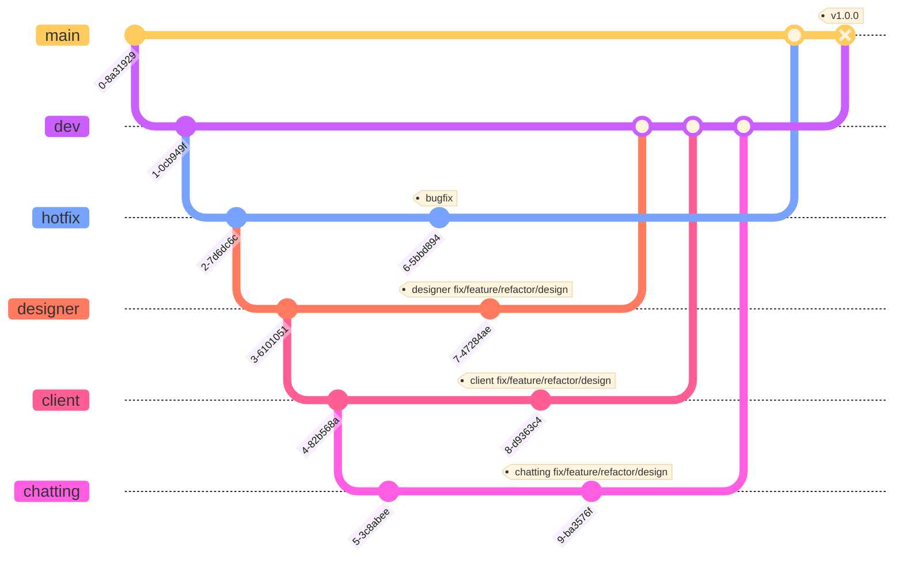

# 프로젝트 제목을 적어주세요

깃 브랜치 전략

```mermaid
%%{init: { 'logLevel': 'debug', 'theme': 'base' } }%%    
gitGraph
commit
branch dev
commit
branch hotfix
commit
branch designer
commit
branch client
commit
branch chatting
commit
checkout hotfix
commit tag:"bugfix"
checkout designer
commit tag:"designer fix/feature/refactor/design"
checkout client
commit tag:"client fix/feature/refactor/design"
checkout chatting
commit tag:"chatting fix/feature/refactor/design"
checkout dev
merge designer
merge client
merge chatting
checkout main
merge hotfix
merge dev type: REVERSE tag: "v1.0.0"
```
